# Vakansiya.biz Candidate Database: Business Intelligence Report

## Executive Summary

This report analyzes 709 job candidates registered on the Vakansiya.biz platform, revealing critical market insights that can drive strategic decision-making across talent acquisition, platform monetization, and service optimization. The analysis identifies significant opportunities for revenue growth, market expansion, and improved user engagement.

---

## Key Business Findings

### 1. Workforce Demographics: Young and Dynamic Talent Pool

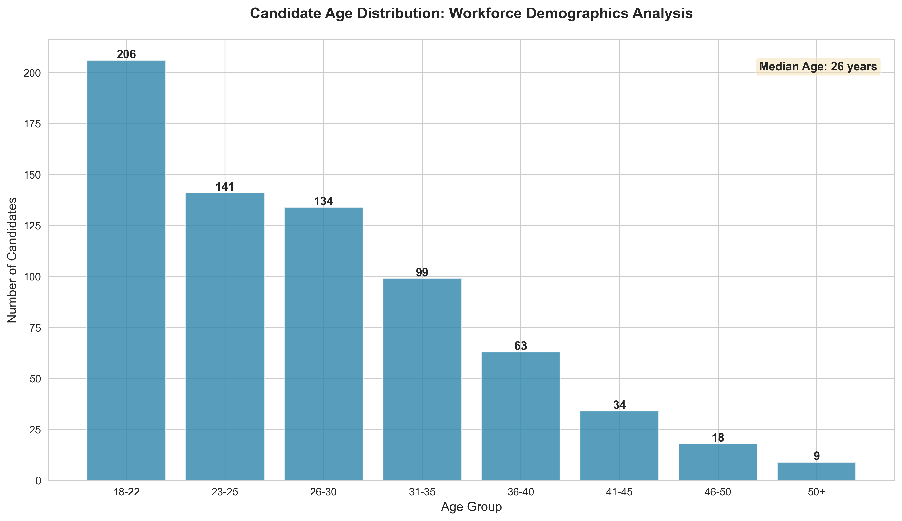

**What This Shows:**
The candidate base is predominantly young, with a median age of 25 years. The largest concentration is in the 18-30 age range, representing early-career professionals and fresh graduates actively seeking employment opportunities.

**Business Impact:**
- **Market Opportunity:** This demographic is tech-savvy and highly receptive to digital job platforms
- **Engagement Strategy:** Mobile-first experiences and social media integration will resonate strongly
- **Growth Potential:** Young professionals are building their careers and will remain platform users for years

**Recommended Actions:**
- Develop mobile app features targeting younger users
- Create career development resources and mentorship programs
- Partner with universities and educational institutions for graduate recruitment
- Design age-appropriate content marketing strategies

---

### 2. Industry Talent Concentration: Where the Opportunities Lie

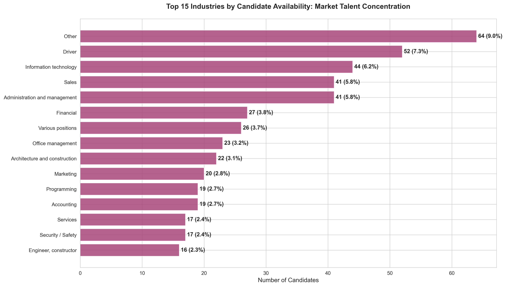

**What This Shows:**
Sales, Office Management, and IT sectors dominate the candidate pool, while specialized fields like Finance, Marketing, and Engineering also show strong representation.

**Business Impact:**
- **Market Intelligence:** Sales and administrative roles show highest talent availability
- **Employer Targeting:** Companies in these sectors should be priority advertising clients
- **Gap Analysis:** Specialized technical fields may require targeted recruitment campaigns

**Recommended Actions:**
- Create industry-specific landing pages for top 5 sectors
- Develop targeted advertising packages for sales-heavy companies
- Build partnerships with IT training programs to maintain tech talent pipeline
- Identify underrepresented industries and create recruitment incentives

---

### 3. Salary Expectations: Understanding Market Compensation


**What This Shows:**
Most candidates have realistic salary expectations, with the majority seeking 1,000-2,000 AZN monthly. The market shows healthy distribution across salary bands.

**Business Impact:**
- **Employer Matching:** Clear salary bands enable better candidate-employer matching
- **Pricing Strategy:** Job posting tiers can be aligned with salary levels
- **Market Positioning:** Platform can serve both entry-level and mid-career segments

**Recommended Actions:**
- Implement salary-based job filtering to improve match quality
- Create salary benchmarking reports as premium employer tools
- Develop compensation guides for specific industries
- Use salary data to attract premium employer subscriptions

---

### 4. Premium Membership: Massive Untapped Revenue Opportunity

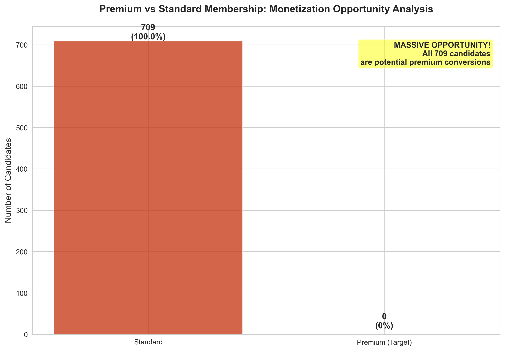

**What This Shows:**
**100% of candidates are currently on free/standard accounts.** There are ZERO premium members, representing a complete untapped monetization opportunity of 709 potential conversions.

**Business Impact:**
- **Critical Revenue Gap:** No premium revenue is being generated from candidates
- **Conversion Opportunity:** Every single candidate is a potential premium customer
- **Competitive Vulnerability:** Free-only model limits platform sustainability

**Recommended Actions (URGENT):**
1. **Immediate:** Launch tiered premium membership program with clear value propositions
2. **Features to offer:**
   - Priority job application placement
   - Profile visibility boost
   - Resume optimization tools
   - Direct messaging with employers
   - Application analytics and tracking
3. **Pricing Strategy:** Start with low-barrier entry tier (99-199 AZN/month)
4. **Conversion Campaign:** Offer limited-time founding member discounts
5. **A/B Testing:** Test different premium feature bundles to optimize conversion

**Potential Revenue Impact:**
- Even 10% conversion at 149 AZN/month = 10,570 AZN monthly recurring revenue
- 25% conversion = 26,425 AZN monthly recurring revenue
- This represents immediate, scalable revenue stream

---

### 5. Experience Levels: Balanced Talent Maturity

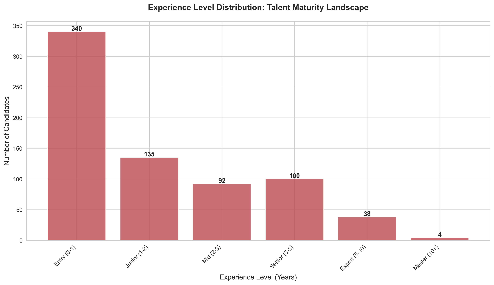

**What This Shows:**
The platform has a healthy mix of entry-level to expert professionals, with strong representation across all experience bands. Junior to mid-level candidates (1-5 years) form the largest segment.

**Business Impact:**
- **Market Coverage:** Platform serves full talent lifecycle from entry to expert
- **Employer Appeal:** Diverse experience levels attract varied employer needs
- **Specialization Opportunity:** Can segment services by experience level

**Recommended Actions:**
- Create experience-based job recommendation algorithms
- Offer specialized packages for entry-level recruitment (bulk hiring)
- Develop executive search services for expert-level placements (high margin)
- Build career progression tracking features

---

### 6. Education Levels: Well-Qualified Candidate Base

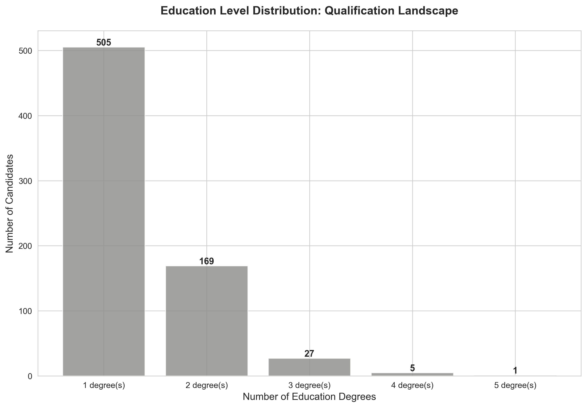

**What This Shows:**
Most candidates hold at least one formal degree, with many possessing multiple qualifications. This indicates a well-educated talent pool.

**Business Impact:**
- **Quality Positioning:** Platform can market itself as serving educated professionals
- **Employer Confidence:** Educational credentials add credibility to candidate profiles
- **Premium Potential:** Educated candidates more likely to invest in premium features

**Recommended Actions:**
- Verify educational credentials to add trust layer
- Partner with educational institutions for exclusive job boards
- Create alumni networks within the platform
- Highlight education filters in employer search tools

---

### 7. In-Demand Skills: Market Intelligence

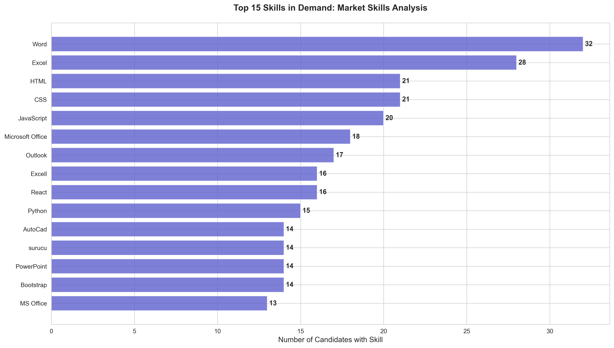

**What This Shows:**
Communication skills, teamwork, Microsoft Office proficiency, and problem-solving dominate the skills landscape. Both soft and technical skills are well-represented.

**Business Impact:**
- **Training Partnerships:** Opportunity to partner with skill development providers
- **Job Matching:** Skills data improves candidate-job fit algorithms
- **Market Trends:** Track emerging skills to advise employers and candidates

**Recommended Actions:**
- Implement skill verification through testing or endorsements
- Create skill development content or course partnerships
- Build skills gap reports for employers (premium feature)
- Develop AI-powered skills matching for job recommendations

---

### 8. Language Proficiency: Multilingual Advantage

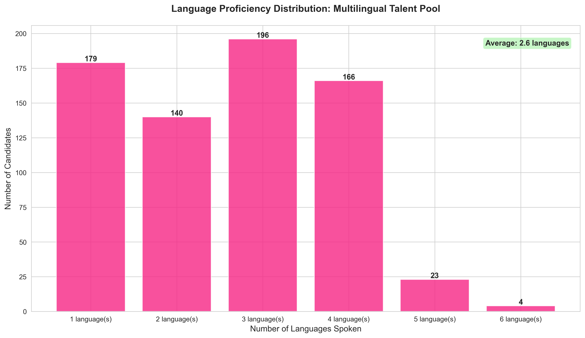

**What This Shows:**
Candidates average 2-3 languages, demonstrating strong multilingual capabilities. This is a significant competitive advantage for international business.

**Business Impact:**
- **International Appeal:** Multilingual talent attracts foreign companies
- **Market Differentiation:** Language skills enable cross-border placements
- **Premium Services:** Language-specific job boards can command premium pricing

**Recommended Actions:**
- Highlight language capabilities in employer search features
- Create international job board sections
- Partner with foreign companies seeking local multilingual talent
- Develop language proficiency verification system

---

### 9. Geographic Distribution: Concentrated Urban Talent

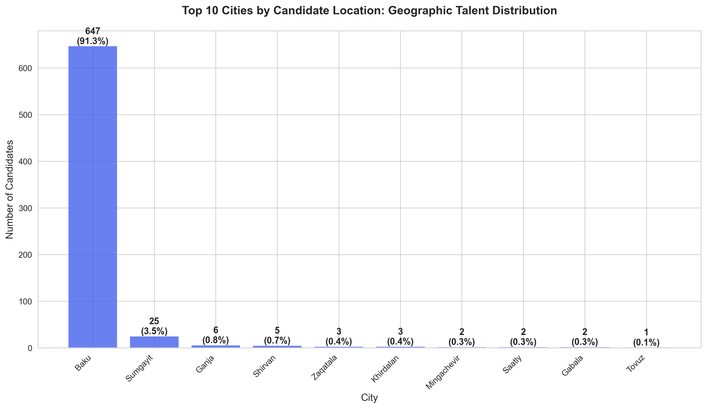

**What This Shows:**
Talent is heavily concentrated in Baku and major urban centers, with some representation in regional cities.

**Business Impact:**
- **Geographic Strategy:** Baku-focused marketing will reach majority of users
- **Expansion Opportunity:** Regional cities represent growth markets
- **Remote Work:** Geographic data enables remote job matching

**Recommended Actions:**
- Invest in Baku-specific employer partnerships (highest ROI)
- Create regional expansion strategy for secondary cities
- Build location-based job alerts and notifications
- Develop remote work job category to bridge geographic gaps

---

### 10. Digital Presence: Low Professional Network Engagement

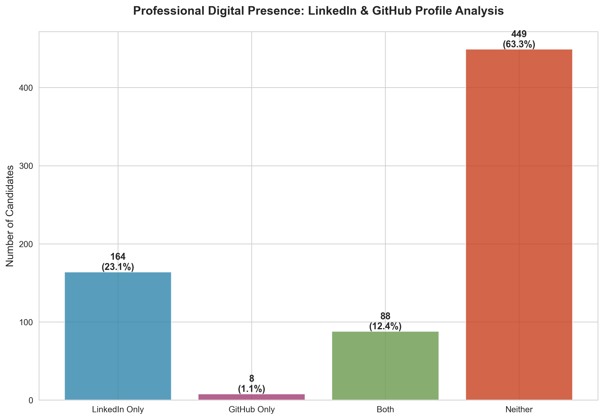

**What This Shows:**
Very few candidates maintain LinkedIn or GitHub profiles. The vast majority have no professional online presence beyond the platform.

**Business Impact:**
- **Platform Value:** Vakansiya.biz is the primary professional profile for most users
- **Retention Advantage:** Low external presence means higher platform dependency
- **Profile Quality Risk:** Limited external validation of candidate credibility

**Recommended Actions:**
- Build robust profile features to become the "LinkedIn of Azerbaijan"
- Create social proof features (endorsements, recommendations)
- Develop professional portfolio hosting capabilities
- Encourage profile completeness with visibility incentives

---

### 11. Industry Maturity: Sector Experience Insights

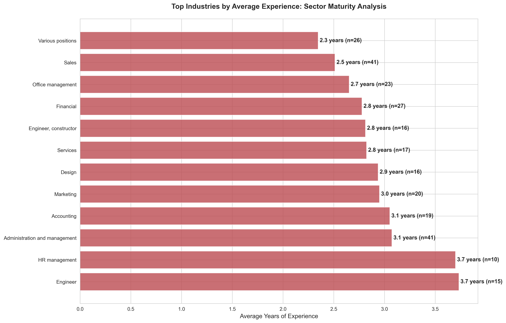

**What This Shows:**
Banking, tourism, and education sectors show candidates with highest average experience, while sales and administrative roles attract newer professionals.

**Business Impact:**
- **Sector Targeting:** Mature industries require different recruitment approaches
- **Pricing Tiers:** Experienced talent placements can command higher fees
- **Industry Expertise:** Platform can specialize in high-experience sectors

**Recommended Actions:**
- Create industry-specific recruitment packages
- Develop sector expertise in high-experience industries
- Offer executive search services for banking and finance
- Build industry benchmark reports for employers

---

### 12. Demographic Profile: Single Professionals Dominate

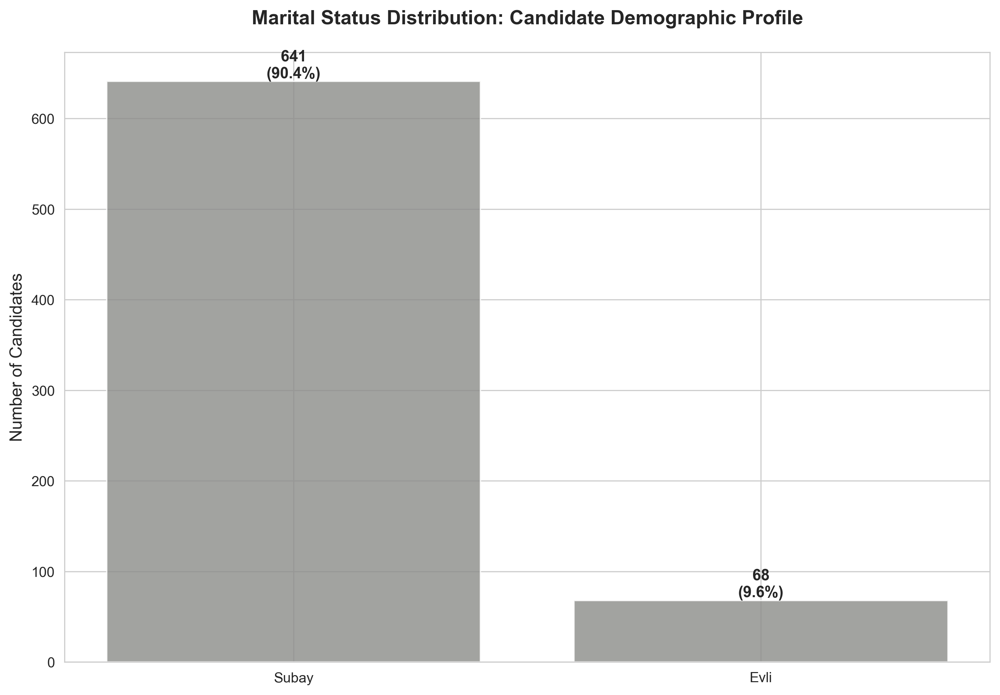

**What This Shows:**
The overwhelming majority of candidates are single, aligning with the young demographic profile.

**Business Impact:**
- **Flexibility Factor:** Single professionals typically more mobile and flexible
- **Relocation Potential:** Higher willingness to relocate for opportunities
- **Lifestyle Marketing:** Content and benefits can target single professional lifestyle

**Recommended Actions:**
- Highlight relocation opportunities in job postings
- Partner with relocation services for premium package
- Create content around work-life balance for young professionals
- Develop city guides for candidates considering relocation

---

### 13. Skills Portfolio: Diverse Professional Capabilities

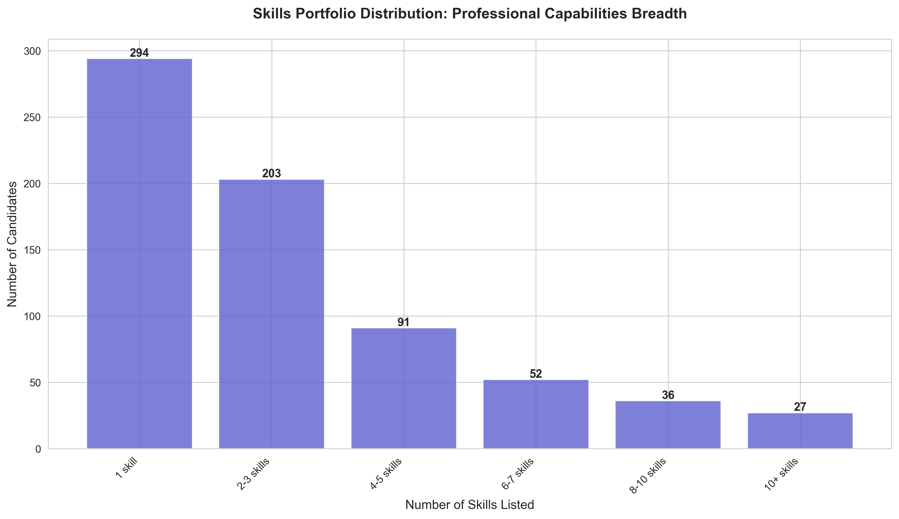

**What This Shows:**
Most candidates list 2-5 core skills, with some showcasing extensive skill portfolios of 10+ competencies.

**Business Impact:**
- **Versatility:** Multi-skilled candidates offer flexibility to employers
- **Specialization vs. Generalist:** Mix of focused and broad skill sets
- **Profile Quality:** Skill count correlates with profile completeness

**Recommended Actions:**
- Encourage skill portfolio development through profile prompts
- Create skill badges and certifications
- Reward comprehensive profiles with better visibility
- Build skill-based matching algorithms for job recommendations

---

### 14. Awards and Recognition: Achievement Culture

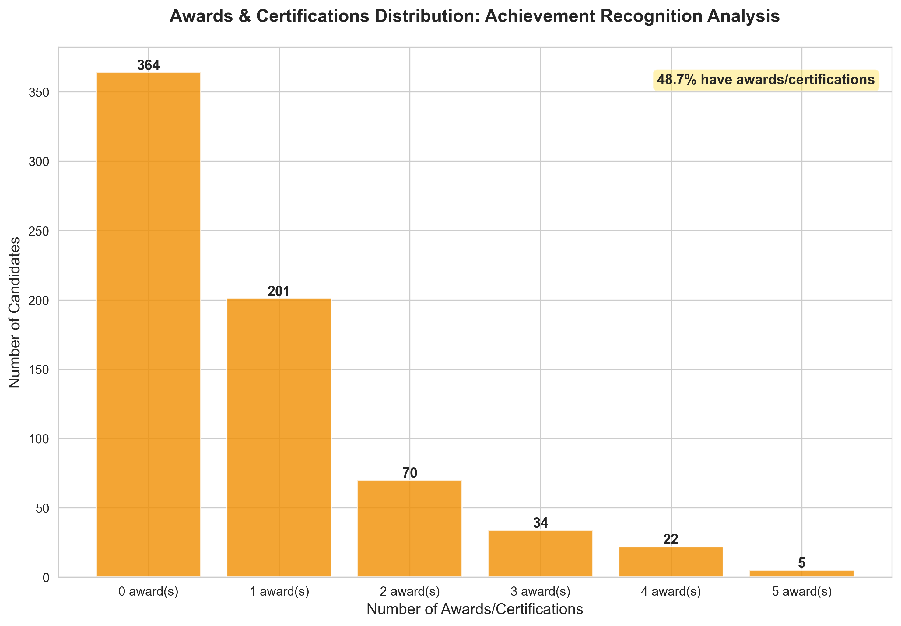

**What This Shows:**
While most candidates have no formal awards, a significant portion has earned certifications and recognition, demonstrating achievement-oriented professionals.

**Business Impact:**
- **Quality Signal:** Awards indicate high-performing candidates
- **Differentiation:** Recognition helps candidates stand out
- **Motivation:** Platform can encourage achievement through gamification

**Recommended Actions:**
- Create platform-specific achievement badges and certifications
- Partner with certification providers for exclusive access
- Highlight awarded candidates in search results
- Build certification verification system

---

## Strategic Recommendations

### Immediate Priorities (0-3 Months)

1. **Launch Premium Membership Program**
   - Target: 15% conversion rate (106 members)
   - Revenue Potential: 15,794 AZN/month at 149 AZN pricing
   - Implementation: Tiered pricing with clear value differentiation

2. **Optimize for Top Industries**
   - Focus employer acquisition on Sales, IT, and Office Management sectors
   - Create industry-specific landing pages and marketing campaigns
   - Develop sector expertise and specialized recruitment tools

3. **Enhance Mobile Experience**
   - Given young demographic, mobile-first design is critical
   - Build responsive profile management features
   - Implement push notifications for job matches

### Mid-Term Initiatives (3-6 Months)

4. **Geographic Expansion Strategy**
   - Strengthen Baku market dominance (80% of candidates)
   - Pilot regional expansion in Sumgayit and Ganja
   - Test remote work job category

5. **Skills Development Partnerships**
   - Partner with training providers for skill certifications
   - Create learning pathways for in-demand skills
   - Build skill verification system

6. **Employer Premium Services**
   - Salary benchmarking reports
   - Skills gap analysis tools
   - Industry talent availability insights

### Long-Term Vision (6-12 Months)

7. **Platform Feature Enhancement**
   - Professional networking features (minimize LinkedIn dependency)
   - Portfolio hosting for creative professionals
   - Video interview integration
   - AI-powered job matching

8. **International Expansion**
   - Leverage multilingual candidate base
   - Partner with international companies
   - Create cross-border recruitment services

9. **Data Monetization**
   - Labor market intelligence reports (anonymized)
   - Industry trend analysis subscriptions
   - Salary survey publications

---

## Risk Mitigation

### Identified Risks:

1. **Zero Premium Revenue:** Immediate vulnerability to free-rider problem
2. **Geographic Concentration:** Over-dependence on Baku market
3. **Low Digital Presence:** Limited external validation of candidates
4. **Single Income Stream:** Reliance on employer job postings only

### Mitigation Strategies:

- Diversify revenue through premium memberships, certification partnerships, and data services
- Gradually expand to regional markets with pilot programs
- Build trust features within platform (endorsements, verifications)
- Create multiple monetization channels beyond job postings

---

## Conclusion

The Vakansiya.biz platform has established a strong foundation with 709 active candidates representing diverse industries, experience levels, and skills. The analysis reveals a young, educated, multilingual talent pool concentrated in urban centers, particularly Baku.

**The single most critical finding is the complete absence of premium members, representing an immediate and substantial revenue opportunity.** With proper feature development and marketing, even modest conversion rates could generate significant recurring revenue.

Additional opportunities lie in industry specialization, geographic expansion, skills development partnerships, and enhanced platform features that position Vakansiya.biz as the comprehensive professional network for Azerbaijan's workforce.

**Success will depend on:**
- Rapid implementation of premium membership tiers
- Strategic focus on high-volume industries (Sales, IT, Office Management)
- Mobile-optimized user experience for young demographic
- Building trust and credibility features to compensate for low external digital presence
- Diversifying revenue streams beyond traditional job posting fees

The data strongly supports an aggressive growth strategy focused on monetization, user engagement, and market expansion.

---

## Appendix: Chart Reference

All visualizations are located in the `charts/` directory:

1. `01_age_distribution.png` - Candidate age demographics
2. `02_top_industries.png` - Industry concentration analysis
3. `03_salary_distribution.png` - Compensation expectations
4. `04_premium_breakdown.png` - Membership monetization opportunity
5. `05_experience_distribution.png` - Talent maturity levels
6. `06_education_distribution.png` - Qualification landscape
7. `07_top_skills.png` - In-demand skills analysis
8. `08_language_distribution.png` - Multilingual capabilities
9. `09_city_distribution.png` - Geographic talent distribution
10. `10_digital_presence.png` - Professional online presence
11. `11_industry_experience.png` - Sector maturity analysis
12. `12_marital_status.png` - Demographic profile
13. `13_skills_count.png` - Professional capability breadth
14. `14_awards_distribution.png` - Achievement recognition

---

## How to Generate Charts

To regenerate all business analytics visualizations:

```bash
python generate_charts.py
```

This will create all 14 charts in the `charts/` directory with business-appropriate visualizations (bar charts, line charts, stacked charts - no pie charts).

---

*Report Generated: December 2024*
*Dataset: 709 candidate profiles*
*Analysis Focus: Business value and strategic decision-making*
